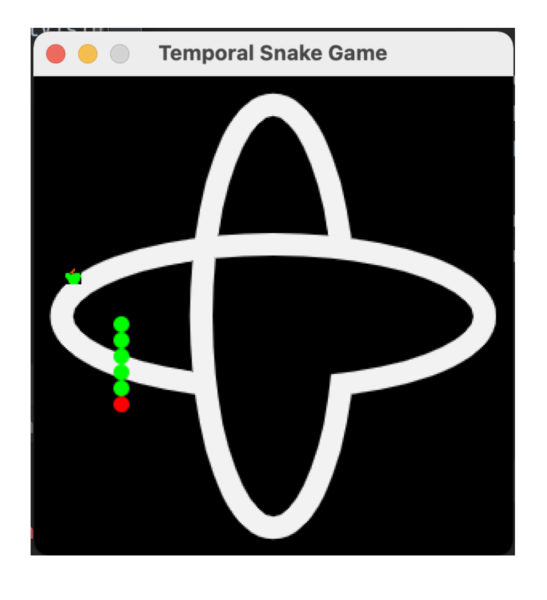

## Temporal Polyglot Example - Snake Game


<p align="center">

</p>


This demo uses the following Temporal SDKs:
* [Java](https://docs.temporal.io/docs/java/introduction)
* [Go](https://docs.temporal.io/docs/go/introduction)
* [PHP](https://docs.temporal.io/docs/php/introduction)

This demo demonstrates how Temporal can be used to orchestrate multiple 
services responsible for different parts of a snake game. 

### Running the demo

#### Start the Temporal Server:
```shell script
git clone https://github.com/temporalio/docker-compose.git
cd  docker-compose
docker compose up
```

#### Start the Game Services

##### Game Controller Service
The Game Controller Service is a Java App that uses the Temporal Java SDK

```shell script
cd game-controller
mvn compile exec:java -Dexec.mainClass="io.temporal.snakegame.controller.ControllerStarter"
```

##### Game Info Service
The Game Info Service is a Go App that uses the Temporal Go SDK

```shell script
cd game-info
go run worker/main.go
```

##### Game Movement Rules Service

The Game Movement Rules Services is a PHP App that uses the Temporal PHP SDK

```shell script
cd game-rules
./rr serve
```

##### Snake Game

The Snake game is a Java app which uses the three started services 
for overall game control, game info such as images, text, fonts background, etc
as well as movement controls.

```shell script
cd game
mvn compile exec:java -Dexec.mainClass="io.temporal.snakegame.SnakeGameStarter"
```

### Playing The Demo

Once the game starts you can use your keyboard LEFT RIGHT UP DOWN keys to move 
the snake across the board. The goal is to eat the apples. Once you eat an apple your snake
will increase and another apple icon will get displayed on the board.
If you run into any of the edges of the board, or into your snake itself the game is over.
